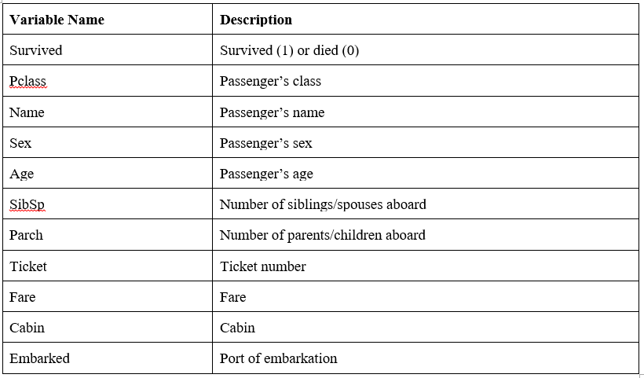

# INTRODUCTION
The remainder of the document is organized as follows. In Section 2, we explain the Titanic dataset. In Section 3, we explain the explanatory data analysis steps. Missing value imputation and outlier detection steps are explained in Section 5 and Section 6. In Section 4 and Section 7 we show the feature engineering steps. Predictive models are explained in the Section 8. Results are shown in Section 9. Finally, we conclude our work in Section 10.

# DATASET
Titanic dataset is used for this project. It contains the survival information of Titanic ship which sank after colliding with an iceberg on April 15, 1912. It killed 1502 out of 2224 including both all the passengers and its crew. One of the reasons this tragedy led to such loss of life was that there were not enough lifeboats for everyone. This tragedy resulted in better safety regulations for ships.

# FIRST STEPS
## Import Required Packages
Firstly, let's import the required packages.

```{r warning=FALSE, message=FALSE}
library('ggplot2') 
library('ggthemes') 
library('scales') 
library('mice') 
library('knitr')
library('dplyr')
library('caret')
library('randomForest')
library('gridExtra')
library('corrplot')
library('Hmisc')
library('ROCR')
library('fpc')
library('DMwR2')
library('dbscan')
```
## Read Data
Let's read the training and testing datasets.

```{r}
train <- read.csv('dataset/train.csv', stringsAsFactors = F, na.strings = c("NA", ""))
test  <- read.csv('dataset/test.csv', stringsAsFactors = F, na.strings = c("NA", ""))
```

Let's combine the training and testing datasets.

```{r}
full  <- bind_rows(train, test)
```

Note that Survived variable is missing from the testing dataset.

# EXPLORATORY DATA ANALYSIS
## Check Data
Let's check the dataset.

```{r}
str(full)
```

There are 1309 observations in total;

* The training dataset has 891,
* The testing dataset has 418 observations.

## Describe Variables
Description of the variables are shown below.

```{r echo=FALSE, fig.cap="Description of the Dataset", fig.align="center", out.width = '75%'}

```

## Investigate the Data
Let’s investigate the variables that contain missing values.

```{r}
sapply(full, function(x) {sum(is.na(x))}) 
```

There are number missing variables in the dataset;

* 418 observations are missing the Survived variable in the testing dataset.
* Cabin is sparsely populated and has lots of mising values.
* Age is missing in some observations.
* Embarked is missing in two observations.
* Fare is missing in a observation.

## Explore the Data
Let’s convert Sex, Pclass, Survived and Embarked variables into factors.

```{r}
full$Sex <- as.factor(full$Sex)
full$Survived <- as.factor(full$Survived)
full$Pclass <- as.factor(full$Pclass) 
full$Embarked <- as.factor(full$Embarked) 
```

### Survived
Let's visualize the Survived variable. It describes the survival information of the people. 

```{r fig.cap="Survival Information of People", fig.align="center", out.width = '75%'}
ggplot(full[!is.na(full$Survived),], aes(x = Survived, fill = Survived)) +
  geom_bar(stat='count') +
  labs(x = 'Survival Information of People') +
    geom_label(stat='count',aes(label=..count..), size=7) 
```

It is clear that 549 people died and 342 people survived in the training dataset.

### Sex
Let’s visualize the Sex variable.

```{r fig.cap="Survival rate of Male/Female Passangers", fig.align="center", out.width = '75%'}
p1 <- ggplot(full, aes(x = Sex, fill = Sex)) +
  geom_bar(stat='count', position='dodge') + theme_grey() +
  labs(x = 'All data') +
        geom_label(stat='count', aes(label=..count..)) +
        scale_fill_manual("legend", values = c("female" = "pink", "male" = "green"))

p2 <- ggplot(full[!is.na(full$Survived),], aes(x = Sex, fill = Survived)) +
  geom_bar(stat='count', position='dodge') + theme_grey() +
  labs(x = 'Training data only') +
        geom_label(stat='count', aes(label=..count..))

grid.arrange(p1,p2, nrow=1)
```

Let’s investigate the plots;

* First plot states that there are 466 female, 843 male passengers.
* Second plot states that 81.1% of men, 25.8% of women died in the training dataset.

### PClass
Let’s visualize the PClass variable.

```{r fig.cap="Passenger Class Information", fig.align="center", out.width = '75%'}
p3 <- ggplot(full, aes(x = Pclass, fill = Pclass)) +
  geom_bar(stat='count', position='dodge') +
  labs(x = 'Pclass, All data') + geom_label(stat='count', aes(label=..count..)) +
   theme(legend.position="none") + theme_grey()     
p4 <- ggplot(full[!is.na(full$Survived),], aes(x = Pclass, fill = Survived)) +
  geom_bar(stat='count', position='dodge') + labs(x = 'Training data only') +
        theme(legend.position="none") + theme_grey()
p5 <- ggplot(full[!is.na(full$Survived),], aes(x = Pclass, fill = Survived)) +
  geom_bar(stat='count', position='stack') +
  labs(x = 'Training data only', y= "Count") + facet_grid(.~Sex) +
        theme(legend.position="none") + theme_grey()
p6 <- ggplot(full[!is.na(full$Survived),], aes(x = Pclass, fill = Survived)) +
  geom_bar(stat='count', position='fill') +
  labs(x = 'Training data only', y= "Percent") + facet_grid(.~Sex) +
        theme(legend.position="none") + theme_grey()
grid.arrange(p3, p4, p5, p6, ncol=2)
```

Let's investigate the plots;

* First plot states that most people was in the 3rd class. 
* Second plot states that majority of 1st and 2nd class passengers survived, while majority of 3rd class died. 
* Third and fourth plots state that almost all women in 1st and 2nd class survived. 

# FEATURE ENGINEERING 1
## Title
We can break the Name variable into more meaningful variables, including; title, name and surname.

```{r}
full$Title <- gsub('(.*, )|(\\..*)', '', full$Name) # Create Title variable
table(full$Sex, full$Title) # Show Title counts
```        

Let’s replace low title counts.        
```{r}
rare_title <- c('Dona', 'Lady', 'the Countess','Capt', 'Col', 'Don',  'Dr', 'Major', 'Rev', 'Sir', 'Jonkheer')
full$Title[full$Title == 'Mlle']        <- 'Miss' 
full$Title[full$Title == 'Ms']          <- 'Miss'
full$Title[full$Title == 'Mme']         <- 'Mrs' 
full$Title[full$Title %in% rare_title]  <- 'Rare Title'
table(full$Sex, full$Title)
```   

Let’s visualize the Title variable.

```{r fig.cap="Visualization of Title Variable", fig.align="center", out.width = '75%'}
ggplot(full[!is.na(full$Survived),], aes(x = Title, fill = Survived)) +
  geom_bar(stat='count', position='stack') +
  labs(x = 'Title') +theme_grey()
```   

It is clear that Title is highly correlated with Survival information.

## Family Size
Let's create a Family size variable.

* It is based on number of siblings/spouse(s) and children/parents. 
* We need to add 1 to include the passenger himself/herself.

```{r}
full$Fsize <- full$SibSp + full$Parch + 1
```  

To better understand the family size variable, let’s use ggplot to visualize the family size and the survival.

```{r fig.cap="Family Size and Survival", fig.align="center", out.width = '75%'}
ggplot(full[1:891,], aes(x = Fsize, fill = factor(Survived))) +
  geom_bar(stat='Count', position='dodge') +
  scale_x_continuous(breaks=c(1:11)) +
  labs(x = 'Family Size')
``` 

It is clear that there is a survival penalty to single passengers and family sizes above 4. 

We can further make Family variable a categorical variable.

```{r fig.align="center", out.width = '75%'}
full$FsizeD[full$Fsize == 1] <- 'singleton'
full$FsizeD[full$Fsize < 5 & full$Fsize > 1] <- 'small'
full$FsizeD[full$Fsize > 4] <- 'large'
mosaicplot(table(full$FsizeD, full$Survived), main='Family Size - Survival', shade=TRUE)
``` 

This plot shows that the survival rate of large families is worse than single and small families.

## Cabin
Let’s take a look into the Cabin variable.

```{r}
full$Cabin[1:28] 
``` 

As you can see, there are lots of missing values. But, we can also infer Deck variable from Cabin variable.

```{r}
strsplit(full$Cabin[2], NULL)[[1]] 
full$Deck<-factor(sapply(full$Cabin, function(x) strsplit(x, NULL)[[1]][1])) 
full$Deck[1:28]
``` 

# MISSING VALUE IMPUTATION
There are some missing values in the dataset. Since, we don’t have many observations, we are better not to delete any of the observations or columns with missing values. Hence, we are trying to replace missing values with sensible values.

## Embarked
Let’s take a look at Embarked variable.

```{r}
subset(full,is.na(full['Embarked']))
``` 

Passengers 62 and 830 are missing Embarkment variable.

```{r}
full[c(62, 830), 'Embarked']
``` 

We can infer their values based on passenger class and fare. 

```{r}
embark_fare <- full %>%
  filter(PassengerId != 62 & PassengerId != 830)
``` 

Let's use ggplot to visualize Embarked, Class and median Fare variables.

```{r fig.align="center", out.width = '75%', warning=FALSE, message=FALSE}
ggplot(embark_fare, aes(x = Embarked, y = Fare, fill = factor(Pclass))) +
  geom_boxplot() +
  geom_hline(aes(yintercept=80), 
    colour='red', linetype='dashed', lwd=2) +
  scale_y_continuous(labels=dollar_format())
``` 

The median fare for a first class passenger departing from Charbourg (‘C’) matches with the $80 Fare variable. Hence, we can replace the NA values with ‘C’.

```{r}
full$Embarked[c(62, 830)] <- 'C'
full[c(62, 830), 'Embarked']
``` 

## Fare
Similar to Embarked variable, Fare variable on row 1044 has an NA value.

```{r}
full[1044, "Fare"]
``` 

Let's show all of the observation.

```{r}
full[1044,]
``` 

This passenger departed from Southampton (‘S’). Let’s visualize the Fares variable with same class and embarkment values.

```{r fig.align="center", out.width = '75%', warning=FALSE, message=FALSE}
ggplot(full[full$Pclass == '3' & full$Embarked == 'S', ], 
  aes(x = Fare)) +
  geom_density(fill = '#99d6ff', alpha=0.4) + 
  geom_vline(aes(xintercept=median(Fare, na.rm=T)),
    colour='red', linetype='dashed', lwd=1) +
  scale_x_continuous(labels=dollar_format())
``` 

From this visualization, it seems quite reasonable to replace the NA values with median for their class and embarkment.

```{r}
full$Fare[1044] <- median(full[full$Pclass == '3' & full$Embarked == 'S', ]$Fare, na.rm = TRUE)
``` 

```{r}
full[1044, "Fare"]
``` 

## Age

There are many missing Age variable in the dataset. Let’s look into the number of missing Age variables.

```{r}
sum(is.na(full$Age))
``` 

There are 263 missing Age variables. We can use mice package to guess the missing Age variables.

```{r}
set.seed(129) # Set a random seed
mice_mod <- mice(full[, !names(full) %in% c('PassengerId','Name','Ticket','Cabin','Family','Surname','Survived')], method='rf') 
mice_output <- complete(mice_mod) # Save the output 
``` 

Let’s compare the results with the original distribution.

```{r fig.align="center", out.width = '75%', warning=FALSE, message=FALSE}
par(mfrow=c(1,2))
hist(full$Age, freq=F, main='Original Data', ylim=c(0,0.04))
hist(mice_output$Age, freq=F, main='MICE Output Data', ylim=c(0,0.04))
``` 

Distributions looks very similar, Let’s replace the Age variables with the mice model.

```{r}
full$Age <- mice_output$Age
``` 

Let's check the Age variable again. 

```{r}
sum(is.na(full$Age))
``` 

# OUTLIER DETECTION

In this section, we are trying to find the outliers. We experiment with three different methods; dbscan, Torgo (2007) and Breunig et al. (2000).

## DBSCAN
Let's define the "dbscan.outliers" function.

```{r}
dbscan.outliers <- function(data, ...) {
  require(fpc, quietly=TRUE)
  cl <- dbscan(data, ...)
  posOuts <- which(cl$cluster == 0)
  list(positions = posOuts,
       outliers = data[posOuts,],
       dbscanResults = cl)
}
``` 

Let's investigate the Fare variable.

```{r}
outs <- dbscan.outliers(full['Fare'],  eps = 3)
full[outs$positions,'Fare']
``` 

Fare values looks reasonable. So, the output of dbscan on the Fare variable didn't reveal any outliers. Let's investigate the Age variable.

```{r}
outs <- dbscan.outliers(full['Age'],  eps = 3)
full[outs$positions,'Age']
``` 

There is someone who is aged 80. But, it is not an outlier either.

## Torgo (2007)

Let's investigate the Fare variable.

```{r}
outs <- outliers.ranking(scale(full['Fare']))
full[outs$rank.outliers[1:10],'Fare']
``` 

These values are very low, but still possible. So, we will not replace these values. Let's investigate the Age variable.

```{r}
outs <- outliers.ranking(scale(full['Age']))
full[outs$rank.outliers[1:10],'Age']
```

These values are not outliers.

## Breunig et al. (2000)
Let's investigate the Fare variable.

```{r}
out.scores <- lofactor(scale(full['Fare']), 15)
top_outliers <- order(out.scores, decreasing = T)[1:10]
full[top_outliers,'Fare']
``` 

These values are very low, but still possible. So, we will not replace these values. Let's investigate the Age variable.

```{r}
out.scores <- lofactor(scale(full['Age']), 15)
top_outliers <- order(out.scores, decreasing = T)[1:10]
full[top_outliers,'Age']
``` 

These values are not outliers.

# FEATURE ENGINEERING 2

We can create a couple of new age-dependent variables: Child and Mother.

* A child is someone under 18 years.
* A mother is someone who is female, older than 18, doesn’t have the ‘Miss’ title and has more than 0 children.

## Child 
Let’s look at the relationship between age and survival.

```{r fig.align="center", out.width = '75%', warning=FALSE, message=FALSE}
ggplot(full[1:891,], aes(Age, fill = factor(Survived))) + 
  geom_histogram() + 
  facet_grid(.~Sex)
``` 

Let’s create a Child variable.

```{r}
full$Child[full$Age < 18] <- 'Child'
full$Child[full$Age >= 18] <- 'Adult'
table(full$Child, full$Survived)
full$Child  <- factor(full$Child)
``` 

## Mother
Similarly, let’s create a Mother variable.

```{r}
full$Mother <- 'Not Mother'
full$Mother[full$Sex == 'female' & full$Parch > 0 & full$Age > 18 & full$Title != 'Miss'] <- 'Mother'
table(full$Mother, full$Survived)
full$Mother <- factor(full$Mother)
``` 

# PREDICTION

We successfully fill the missing values and created new variables in the Titanic datasets. In this section, we will build some models to predict the Survival variable. Let’s first check the datasets again using the completeness function.

```{r}
sapply(full, function(x) {sum(is.na(x))})
``` 

Let's factorize some variables.

```{r}
full$Sex <- as.factor(full$Sex)
full$Embarked <- as.factor(full$Embarked)
full$Title<- as.factor(full$Title) 
full$FsizeD<- as.factor(full$FsizeD)
``` 

As you can see, we have many new variables. Also, we replaced some missing values with their sensible values. Again, we need to convert some variables into factor.

## Split Dataset
Let’s split the data back into a training and test datasets.

```{r}
train <- full[1:891,]
test <- full[892:1309,]
```

## RandomForest Model
Let’s build the RandomForest model.

```{r}
set.seed(2017)
random_forrest_model <- randomForest(factor(Survived) ~ Pclass + Sex + Age + SibSp + Parch + 
                                       Fare + Embarked + Title + 
                                       FsizeD + Child + Mother, data = train)
```

Let’s predict the Survival column and write output into a file.

```{r}
random_forrest_predictions <- predict(random_forrest_model, test)
random_forrest_solutions <- data.frame(PassengerID = test$PassengerId, Survived = random_forrest_predictions)
write.csv(random_forrest_solutions, file = 'output/random_forrest_solutions.csv', row.names = F)
```

The final result for RandomForest model is **0.78947**. Let’s visualize the error rate.

```{r fig.align="center", out.width = '75%', warning=FALSE, message=FALSE}
plot(random_forrest_model, ylim=c(0,0.36))
legend('topright', colnames(random_forrest_model$err.rate), col=1:3, fill=1:3)
```

The black line shows the overall error rate. The red and green lines show the error rate of ‘died’ and ‘survived’.

### Visualize the Importance

Let’s visualize the importance of variables.

```{r fig.align="center", out.width = '75%', warning=FALSE, message=FALSE}
random_forrest_importance <- varImp(random_forrest_model, scale = FALSE)
importance_scores <- data.frame(Variables = row.names(random_forrest_importance), MeanDecreaseGini = random_forrest_importance$Overall)
ggplot(importance_scores, aes(x=reorder(Variables, MeanDecreaseGini), y=MeanDecreaseGini, fill=MeanDecreaseGini)) +
  geom_bar(stat='identity') + coord_flip() + theme(legend.position="none") + labs(x="") +
  ggtitle('Variable Importance Random Forest') + theme(plot.title = element_text(hjust = 0.5))
```

It is clear in the plot that, the Title variable has the highest relative importance.

## SVM Model

```{r}
set.seed(2017)
svm_model <- train(Survived~ Pclass + Sex + Age + SibSp + Parch + Fare + Embarked + Title + 
                     FsizeD + Child + Mother, data=train, method='svmRadial', preProcess= c('center', 'scale'), trControl=trainControl(method="cv", number=5))
svm_model
svm_model$results

svm_predictions <- predict(svm_model, test)
svm_solutions <- data.frame(PassengerID = test$PassengerId, Survived = svm_predictions)
write.csv(svm_solutions, file = 'output/svm_solutions.csv', row.names = F)
```

The final result for SVM model is **0.80382**.

## GBM Model

```{r}
set.seed(2017)
gbm_model <- train(Survived~ Pclass + Sex + Age + SibSp + Parch + Fare + Embarked + Title + 
                       FsizeD + Child + Mother, data=train, method='gbm', preProcess= c('center', 'scale'), trControl=trainControl(method="cv", number=7), verbose=FALSE)
print(gbm_model)

gbm_predictions <- predict(gbm_model, test)
gbm_solutions <- data.frame(PassengerID = test$PassengerId, Survived = gbm_predictions)
write.csv(gbm_solutions, file = 'output/gbm_solutions.csv', row.names = F)
```

The final result for GBM model is **0.76555**.

# RESULTS

Results are evaluated in Kaggle. Scores are shown below.

```{r}
random_forrest_model_result <- 0.78947
svm_model_result <- 0.80382
gbm_model_result <- 0.76555
```

Let's compare the results in a plot.

```{r fig.align="center", out.width = '75%', warning=FALSE, message=FALSE}
barplot(c(random_forrest_model_result, svm_model_result, gbm_model_result), main="Results", names.arg=c("Random Forrest","SVM","GBM"),col = rainbow(3), xlab="Model")
```

It is clear that SVM model achives the best results. RandomForrest gets the second best result. Finally GBM model is the third model.

# CONCLUSION

In this work, we tried to predict the survival information of the passengers in the Titanic shipwreck. We did explanatory data analysis and showed some illustrative data visualizations. We did feature engineering and create more meaningful variables. We did missing value imputation and outlier detection. Finally, we built RandomForrest, SVM and GBM models to predict the survival information of the passengers.